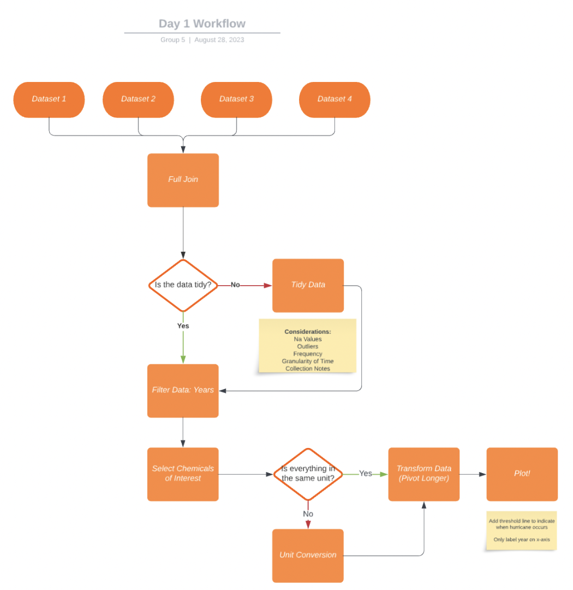
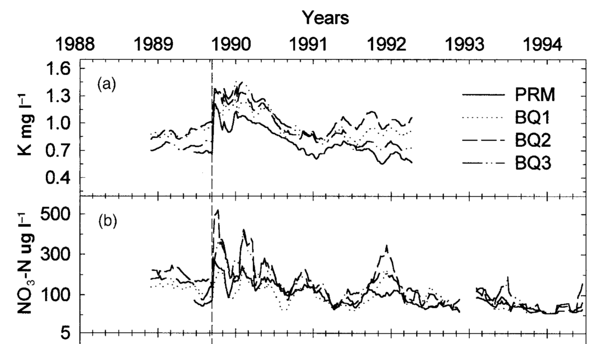
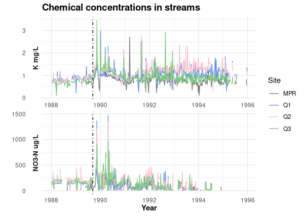
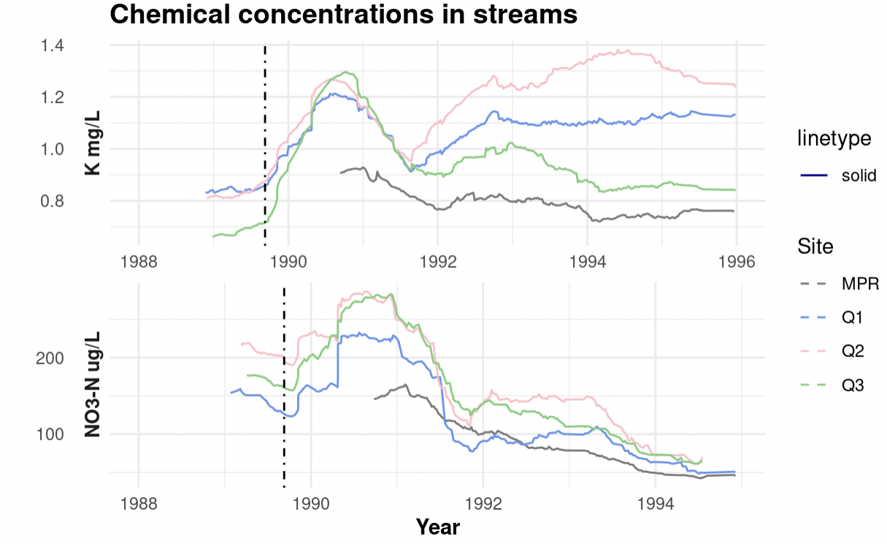
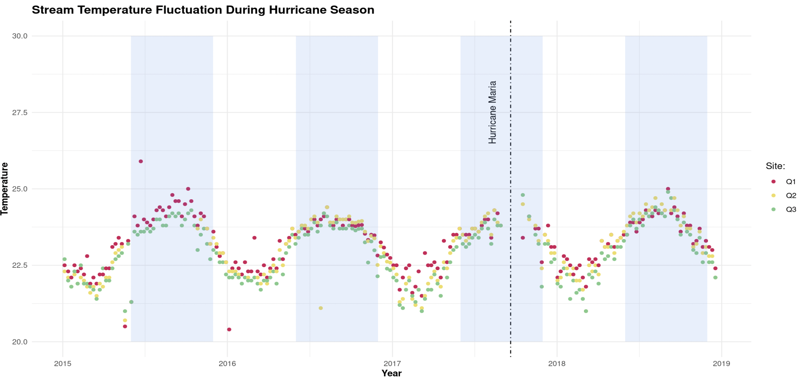

# Investigating the Impact of Hurricane On Stream Chemistry data in Luqillo

## Course Project as Part of EDS 214: Analytical Workflows & Scientific Reproducibilty

Find our github repository [here](https://github.com/Vanessa-Salgado/EDS214_group_project_team_siguana/tree/main) .

Source: [Investigating the impact of Hurricane Hugo on Stream Chemistry data in Luquillo](https://brunj7.github.io/EDS-214-analytical-workflows/group_project.html)

Group Project Members: Carly Caswell, [Luna Catalan](https://github.com/lunacatalan), [Hope Hahn](https://github.com/h-hahn), [Vanessa Salgado](https://github.com/Vanessa-Salgado)

## Workflow

After following out Workflow chart, we could tidy and isolate for the time period and chemicals needed from the four original data sets.

{width="192"}

## Goal 1 - Reproducing and Improving a Plot

### Original Plot Indicating Chemical Concentrations during Hurricane Hugo

This graph shows the concentrations of the chemicals in the streams by date.

{width="3.89in" height="2.18in"}

### Recreated Plot

This graph shows the concentrations of the chemicals in the streams by date. It looks busier than the published graphs that we were supposed to recreate, so we looked into the paper and saw that they smoothed out their curves by using 9 week moving averages, they thought it would reduce business more to see general trends.

{width="399"}

### Improvements on Plot 1

Upon reading the scientific paper, our team found out that the chemical concentrations were measured over 9 weeks, therefore we graphed over 9 week moving averages.

{width="474"}

## Goal 2 - Posing our Own Question

### Can temperature patterns be identified in Puerto Rico during hurricane season from years 2015 to 2019?

What we can see with this graph is the fluctuation of stream temperature (in celsius) over the years 2015 - 2019 for 3 specific locations in Puerto Rico (q1, q2, q3). We were able to layer on hurricane season (shown with the blue rectangles) to conclude that the temperature of the water is greater during the hurricane/rainy period (June - November, September as peak). We also noted pivotal hurricanes during this time period with external research. In this case, we found that Hurricane Maria (the deadliest and most severe hurricane during this time period) had a steeper drop in stream temperature after the hurricane and also had a lot of data missing due to the severity of the storm.

### {width="475"}

## References
